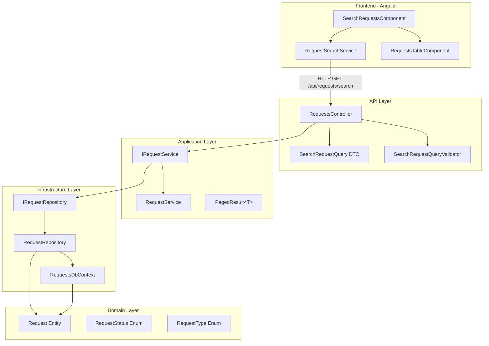
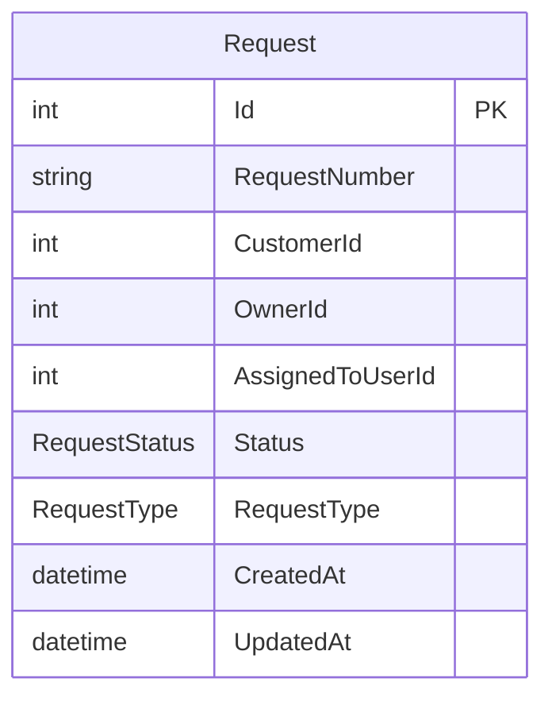

# מסמך תכנון - תכונת חיפוש וסינון בקשות

## Overview

מסמך זה מפרט את התכנון הטכני עבור תכונת חיפוש וסינון בקשות במערכת Requests. התכונה נועדה לפתור את בעיית הביצועים הקיימת, בה כל הרשומות נטענות לזיכרון לפני הסינון, ולהחליפה בפתרון מבוסס IQueryable המבצע סינון ברמת בסיס הנתונים.

### מטרות עיקריות

1. **ביצועים** - סינון ברמת ה-Database באמצעות IQueryable במקום טעינת כל הנתונים לזיכרון
2. **גמישות** - תמיכה בחיפוש חלקי, סינון לפי סטטוסים מרובים, טווח תאריכים וסוג בקשה
3. **אבטחה** - הרשאות ברמת השאילתה והגנה מפני SQL Injection
4. **חוויית משתמש** - ממשק Angular ידידותי עם תמיכה בדפדוף ומיון

### מגבלות ודרישות

- .NET 8 ו-Entity Framework Core 8
- Angular 18+ לצד הלקוח
- תמיכה ב-InMemory Database לבדיקות
- זמן תגובה מקסימלי של 500ms למיליון רשומות (עם אינדקסים מתאימים)

---

## Architecture

### תרשים ארכיטקטורה כללי



### זרימת הבקשה

```mermaid
sequenceDiagram
    participant Client as Angular Client
    participant Controller as RequestsController
    participant Validator as SearchRequestQueryValidator
    participant Service as RequestService
    participant Repo as RequestRepository
    participant DB as Database
    
    Client->>Controller: GET /api/requests/search?params
    Controller->>Validator: Validate(query)
    
    alt Validation Failed
        Validator-->>Controller: ValidationResult (errors)
        Controller-->>Client: 400 Bad Request
    else Validation Passed
        Controller->>Service: SearchAsync(query, userId, isAdmin)
        Service->>Repo: SearchAsync(predicate, pageParams)
        Repo->>DB: IQueryable + Count + ToListAsync
        DB-->>Repo: Results
        Repo-->>Service: PagedResult&lt;Request&gt;
        Service-->>Controller: PagedResult&lt;RequestDto&gt;
        Controller-->>Client: 200 OK + JSON
    end
```

### מבנה שכבות

הפתרון מיישם ארכיטקטורת Clean Architecture עם הפרדה ברורה בין שכבות:

| שכבה | אחריות | קבצים עיקריים |
|------|--------|---------------|
| Domain | ישויות וכללי עסקים | `Request.cs`, `RequestStatus.cs`, `RequestType.cs` |
| Application | לוגיקה עסקית וממשקים | `IRequestService.cs`, `IRequestRepository.cs`, `SearchRequestQuery.cs`, `PagedResult.cs` |
| Infrastructure | גישה לנתונים | `RequestRepository.cs`, `RequestsDbContext.cs` |
| API | נקודות קצה | `RequestsController.cs`, `SearchRequestQueryValidator.cs` |

---

## Components and Interfaces

### Backend Components

#### 1. SearchRequestQuery - DTO לפרמטרי חיפוש

```csharp
namespace Requests.Application.Requests;

/// <summary>
/// Data Transfer Object for search query parameters
/// </summary>
public sealed record SearchRequestQuery
{
    /// <summary>
    /// Partial request number search (case-insensitive contains)
    /// </summary>
    public string? RequestNumber { get; init; }
    
    /// <summary>
    /// Filter by one or more statuses (OR logic)
    /// </summary>
    public List<RequestStatus>? Statuses { get; init; }
    
    /// <summary>
    /// Filter by request type
    /// </summary>
    public RequestType? RequestType { get; init; }
    
    /// <summary>
    /// Start date filter (inclusive, UTC)
    /// </summary>
    public DateTime? DateFrom { get; init; }
    
    /// <summary>
    /// End date filter (inclusive, UTC)
    /// </summary>
    public DateTime? DateTo { get; init; }
    
    /// <summary>
    /// Sort field name (must be in whitelist)
    /// </summary>
    public string? SortBy { get; init; }
    
    /// <summary>
    /// Sort direction: "asc" or "desc"
    /// </summary>
    public string? SortDirection { get; init; }
    
    /// <summary>
    /// Page number (1-based)
    /// </summary>
    public int PageNumber { get; init; } = 1;
    
    /// <summary>
    /// Page size (1-100)
    /// </summary>
    public int PageSize { get; init; } = 20;
}
```

#### 2. PagedResult&lt;T&gt; - מעטפת תוצאות מדופדפות

```csharp
namespace Requests.Application.Requests;

/// <summary>
/// Generic wrapper for paginated results
/// </summary>
public sealed record PagedResult<T>
{
    /// <summary>
    /// Items in the current page
    /// </summary>
    public required IReadOnlyList<T> Items { get; init; }
    
    /// <summary>
    /// Total count of all matching records
    /// </summary>
    public required int TotalCount { get; init; }
    
    /// <summary>
    /// Current page number (1-based)
    /// </summary>
    public required int PageNumber { get; init; }
    
    /// <summary>
    /// Page size
    /// </summary>
    public required int PageSize { get; init; }
    
    /// <summary>
    /// Total pages calculated from TotalCount and PageSize
    /// </summary>
    public int TotalPages => (int)Math.Ceiling((double)TotalCount / PageSize);
    
    /// <summary>
    /// Whether there is a next page
    /// </summary>
    public bool HasNextPage => PageNumber < TotalPages;
    
    /// <summary>
    /// Whether there is a previous page
    /// </summary>
    public bool HasPreviousPage => PageNumber > 1;
}
```

#### 3. SearchRequestQueryValidator - ולידציה באמצעות FluentValidation

```csharp
namespace Requests.Api.Validators;

public sealed class SearchRequestQueryValidator : AbstractValidator<SearchRequestQuery>
{
    private static readonly HashSet<string> AllowedSortFields = new(StringComparer.OrdinalIgnoreCase)
    {
        "Id", "RequestNumber", "Status", "RequestType", "CreatedAt", "CustomerId", "OwnerId"
    };
    
    public SearchRequestQueryValidator()
    {
        RuleFor(x => x.PageNumber)
            .GreaterThanOrEqualTo(1)
            .WithMessage("Page number must be at least 1");
            
        RuleFor(x => x.PageSize)
            .InclusiveBetween(1, 100)
            .WithMessage("Page size must be between 1 and 100");
            
        RuleFor(x => x.SortBy)
            .Must(BeValidSortField)
            .When(x => !string.IsNullOrEmpty(x.SortBy))
            .WithMessage($"Sort field must be one of: {string.Join(", ", AllowedSortFields)}");
            
        RuleFor(x => x.SortDirection)
            .Must(x => string.IsNullOrEmpty(x) || 
                       x.Equals("asc", StringComparison.OrdinalIgnoreCase) || 
                       x.Equals("desc", StringComparison.OrdinalIgnoreCase))
            .WithMessage("Sort direction must be 'asc' or 'desc'");
            
        RuleFor(x => x)
            .Must(x => !x.DateFrom.HasValue || !x.DateTo.HasValue || x.DateFrom <= x.DateTo)
            .WithMessage("DateFrom must be less than or equal to DateTo");
            
        RuleForEach(x => x.Statuses)
            .IsInEnum()
            .When(x => x.Statuses != null && x.Statuses.Any())
            .WithMessage("Invalid status value");
            
        RuleFor(x => x.RequestType)
            .IsInEnum()
            .When(x => x.RequestType.HasValue)
            .WithMessage("Invalid request type value");
    }
    
    private static bool BeValidSortField(string? sortBy) 
        => string.IsNullOrEmpty(sortBy) || AllowedSortFields.Contains(sortBy);
}
```

#### 4. IRequestRepository - ממשק Repository מעודכן

```csharp
namespace Requests.Application.Requests;

public interface IRequestRepository
{
    Task<List<Request>> GetAllAsync(CancellationToken cancellationToken = default);
    
    /// <summary>
    /// Search requests with server-side filtering, sorting, and pagination
    /// </summary>
    Task<PagedResult<Request>> SearchAsync(
        Expression<Func<Request, bool>>? filter,
        string? sortBy,
        bool sortDescending,
        int pageNumber,
        int pageSize,
        CancellationToken cancellationToken = default);
}
```

#### 5. IRequestService - ממשק Service מעודכן

```csharp
namespace Requests.Application.Requests;

public interface IRequestService
{
    Task<IReadOnlyList<RequestDto>> GetRequestsAsync(
        int currentUserId,
        bool isAdministrator,
        CancellationToken cancellationToken = default);
        
    /// <summary>
    /// Search requests with filtering, authorization, sorting, and pagination
    /// </summary>
    Task<PagedResult<RequestDto>> SearchAsync(
        SearchRequestQuery query,
        int currentUserId,
        bool isAdministrator,
        CancellationToken cancellationToken = default);
}
```

### Frontend Components (Angular)

#### 1. מודל נתונים

```typescript
// models/search-request-query.model.ts
export interface SearchRequestQuery {
  requestNumber?: string;
  statuses?: RequestStatus[];
  requestType?: RequestType;
  dateFrom?: string;  // ISO 8601 format
  dateTo?: string;    // ISO 8601 format
  sortBy?: string;
  sortDirection?: 'asc' | 'desc';
  pageNumber: number;
  pageSize: number;
}

// models/paged-result.model.ts
export interface PagedResult<T> {
  items: T[];
  totalCount: number;
  pageNumber: number;
  pageSize: number;
  totalPages: number;
  hasNextPage: boolean;
  hasPreviousPage: boolean;
}

// models/request.model.ts
export interface RequestDto {
  id: number;
  requestNumber: string;
  customerId: number;
  ownerId: number;
  assignedToUserId: number | null;
  status: RequestStatus;
  requestType: RequestType;
  createdAt: string;
}

export enum RequestStatus {
  New = 1,
  InProgress = 2,
  Completed = 3,
  Cancelled = 4
}

export enum RequestType {
  General = 1,
  Legal = 2,
  Payment = 3,
  Appeal = 4
}
```

#### 2. RequestSearchService

```typescript
// services/request-search.service.ts
@Injectable({ providedIn: 'root' })
export class RequestSearchService {
  private readonly http = inject(HttpClient);
  private readonly apiUrl = '/api/requests/search';
  
  search(query: SearchRequestQuery): Observable<PagedResult<RequestDto>> {
    const params = this.buildHttpParams(query);
    return this.http.get<PagedResult<RequestDto>>(this.apiUrl, { params });
  }
  
  private buildHttpParams(query: SearchRequestQuery): HttpParams {
    let params = new HttpParams()
      .set('pageNumber', query.pageNumber.toString())
      .set('pageSize', query.pageSize.toString());
      
    if (query.requestNumber) {
      params = params.set('requestNumber', query.requestNumber);
    }
    if (query.statuses?.length) {
      query.statuses.forEach(s => params = params.append('statuses', s.toString()));
    }
    if (query.requestType) {
      params = params.set('requestType', query.requestType.toString());
    }
    if (query.dateFrom) {
      params = params.set('dateFrom', query.dateFrom);
    }
    if (query.dateTo) {
      params = params.set('dateTo', query.dateTo);
    }
    if (query.sortBy) {
      params = params.set('sortBy', query.sortBy);
    }
    if (query.sortDirection) {
      params = params.set('sortDirection', query.sortDirection);
    }
    
    return params;
  }
}
```

#### 3. SearchRequestsComponent

**הערה חשובה - סנכרון URL (המלצה לפרודקשן):**
המימוש הנוכחי מנהל את הפרמטרים בתוך FormGroup מקומי בלבד. עבור חוויית משתמש טובה יותר, מומלץ לסנכרן את הפרמטרים עם ה-URL באמצעות `ActivatedRoute` ו-`Router.navigate`. בדרך זו:
- אם משתמש עושה Refresh לעמוד, מצב הסינון והעמוד הנוכחי נשמרים
- אפשר לשתף URL עם פילטרים מסוימים לעמיתים
- ה-Back/Forward של הדפדפן עובדים עם החיפושים

```typescript
// components/search-requests/search-requests.component.ts
@Component({
  selector: 'app-search-requests',
  templateUrl: './search-requests.component.html',
  styleUrls: ['./search-requests.component.scss'],
  changeDetection: ChangeDetectionStrategy.OnPush
})
export class SearchRequestsComponent implements OnInit, OnDestroy {
  private readonly searchService = inject(RequestSearchService);
  private readonly route = inject(ActivatedRoute);    // For URL sync (recommended)
  private readonly router = inject(Router);           // For URL sync (recommended)
  private readonly destroy$ = new Subject<void>();
  
  // Form state
  searchForm: FormGroup;
  
  // Results state
  results$ = new BehaviorSubject<PagedResult<RequestDto> | null>(null);
  loading$ = new BehaviorSubject<boolean>(false);
  error$ = new BehaviorSubject<string | null>(null);
  
  // Dropdown options
  statusOptions = Object.values(RequestStatus).filter(v => typeof v === 'number');
  typeOptions = Object.values(RequestType).filter(v => typeof v === 'number');
  sortFieldOptions = ['Id', 'RequestNumber', 'Status', 'RequestType', 'CreatedAt', 'CustomerId', 'OwnerId'];
  
  ngOnInit(): void {
    this.initForm();
    // Optional: Initialize form from URL query params for URL sync
    // this.initFormFromQueryParams();
  }
  
  ngOnDestroy(): void {
    this.destroy$.next();
    this.destroy$.complete();
  }
  
  onSearch(): void {
    if (this.loading$.value) return;
    
    this.loading$.next(true);
    this.error$.next(null);
    
    const query = this.buildQueryFromForm();
    
    // Optional: Sync state to URL for bookmarkable/shareable searches
    // this.router.navigate([], { queryParams: query, queryParamsHandling: 'merge' });
    
    this.searchService.search(query)
      .pipe(takeUntil(this.destroy$))
      .subscribe({
        next: result => {
          this.results$.next(result);
          this.loading$.next(false);
        },
        error: err => {
          this.error$.next(this.extractErrorMessage(err));
          this.loading$.next(false);
        }
      });
  }
  
  onClear(): void {
    this.searchForm.reset({
      pageNumber: 1,
      pageSize: 20
    });
    this.results$.next(null);
    this.error$.next(null);
    // Optional: Clear URL query params
    // this.router.navigate([], { queryParams: {} });
  }
  
  onPageChange(pageNumber: number): void {
    this.searchForm.patchValue({ pageNumber });
    this.onSearch();
  }
}
```

---

## Data Models

### ישויות קיימות

#### Request Entity

```csharp
namespace Requests.Domain.Entities;

public class Request
{
    public int Id { get; set; }
    public string RequestNumber { get; set; } = string.Empty;
    public int CustomerId { get; set; }
    public int OwnerId { get; set; }
    public int? AssignedToUserId { get; set; }
    public RequestStatus Status { get; set; }
    public RequestType RequestType { get; set; }
    public DateTime CreatedAt { get; set; }
    public DateTime UpdatedAt { get; set; }
}
```

#### RequestStatus Enum

```csharp
public enum RequestStatus
{
    New = 1,
    InProgress = 2,
    Completed = 3,
    Cancelled = 4
}
```

#### RequestType Enum

```csharp
public enum RequestType
{
    General = 1,
    Legal = 2,
    Payment = 3,
    Appeal = 4
}
```

### אינדקסים מומלצים

לצורך אופטימיזציית ביצועים, מומלץ להוסיף את האינדקסים הבאים:

```sql
-- Index for ownership/assignment filtering (most common filter)
CREATE INDEX IX_Requests_OwnerId_AssignedToUserId 
ON Requests (OwnerId, AssignedToUserId);

-- Index for status filtering
CREATE INDEX IX_Requests_Status ON Requests (Status);

-- Index for date range filtering
CREATE INDEX IX_Requests_CreatedAt ON Requests (CreatedAt DESC);

-- Index for request number search
CREATE INDEX IX_Requests_RequestNumber ON Requests (RequestNumber);

-- Composite index for common query patterns
CREATE INDEX IX_Requests_Status_CreatedAt 
ON Requests (Status, CreatedAt DESC);
```

### תרשים ERD



---

## תכנון מפורט - Backend

### RequestRepository - מימוש IQueryable

```csharp
namespace Requests.Infrastructure.Repositories;

public sealed class RequestRepository : IRequestRepository
{
    private readonly RequestsDbContext _db;
    
    // Sort field mapping for security
    private static readonly Dictionary<string, Expression<Func<Request, object>>> SortMappings = 
        new(StringComparer.OrdinalIgnoreCase)
    {
        ["Id"] = r => r.Id,
        ["RequestNumber"] = r => r.RequestNumber,
        ["Status"] = r => r.Status,
        ["RequestType"] = r => r.RequestType,
        ["CreatedAt"] = r => r.CreatedAt,
        ["CustomerId"] = r => r.CustomerId,
        ["OwnerId"] = r => r.OwnerId
    };

    public RequestRepository(RequestsDbContext db)
    {
        _db = db;
    }

    public Task<List<Request>> GetAllAsync(CancellationToken cancellationToken = default)
    {
        return _db.Requests.ToListAsync(cancellationToken);
    }

    public async Task<PagedResult<Request>> SearchAsync(
        Expression<Func<Request, bool>>? filter,
        string? sortBy,
        bool sortDescending,
        int pageNumber,
        int pageSize,
        CancellationToken cancellationToken = default)
    {
        // Start with base query - AsNoTracking for read-only performance
        IQueryable<Request> query = _db.Requests.AsNoTracking();
        
        // Apply filter at IQueryable level (translated to SQL)
        if (filter != null)
        {
            query = query.Where(filter);
        }
        
        // Get total count (single DB call)
        var totalCount = await query.CountAsync(cancellationToken);
        
        // Apply sorting using whitelist mapping
        query = ApplySorting(query, sortBy, sortDescending);
        
        // Apply pagination
        var skip = (pageNumber - 1) * pageSize;
        var items = await query
            .Skip(skip)
            .Take(pageSize)
            .ToListAsync(cancellationToken);
        
        return new PagedResult<Request>
        {
            Items = items,
            TotalCount = totalCount,
            PageNumber = pageNumber,
            PageSize = pageSize
        };
    }
    
    private static IQueryable<Request> ApplySorting(
        IQueryable<Request> query, 
        string? sortBy, 
        bool sortDescending)
    {
        // Default sort if not specified
        if (string.IsNullOrEmpty(sortBy) || !SortMappings.ContainsKey(sortBy))
        {
            // IMPORTANT: Always add Id as tie-breaker to ensure deterministic pagination.
            // Without this, sorting by non-unique fields (Status, RequestType) can cause
            // duplicate or missing records across pages.
            return query.OrderByDescending(r => r.CreatedAt).ThenByDescending(r => r.Id);
        }
        
        var sortExpression = SortMappings[sortBy];
        
        // Always add ThenBy(Id) as tie-breaker for deterministic pagination
        return sortDescending 
            ? query.OrderByDescending(sortExpression).ThenByDescending(r => r.Id)
            : query.OrderBy(sortExpression).ThenBy(r => r.Id);
    }
}
```

### RequestService - בניית Predicate והרשאות

```csharp
namespace Requests.Application.Requests;

public sealed class RequestService : IRequestService
{
    private readonly IRequestRepository _repository;

    public RequestService(IRequestRepository repository)
    {
        _repository = repository;
    }

    public async Task<IReadOnlyList<RequestDto>> GetRequestsAsync(
        int currentUserId,
        bool isAdministrator,
        CancellationToken cancellationToken = default)
    {
        // Existing implementation unchanged
        var requests = await _repository.GetAllAsync(cancellationToken);

        if (!isAdministrator)
        {
            requests = requests
                .Where(x => x.OwnerId == currentUserId || x.AssignedToUserId == currentUserId)
                .ToList();
        }

        return requests.Select(MapToDto).ToList();
    }

    public async Task<PagedResult<RequestDto>> SearchAsync(
        SearchRequestQuery query,
        int currentUserId,
        bool isAdministrator,
        CancellationToken cancellationToken = default)
    {
        // Build combined filter predicate
        var filter = BuildFilterExpression(query, currentUserId, isAdministrator);
        
        // Determine sort direction
        var sortDescending = string.Equals(query.SortDirection, "desc", StringComparison.OrdinalIgnoreCase) 
                            || string.IsNullOrEmpty(query.SortDirection);
        
        // Normalize page number
        var pageNumber = Math.Max(1, query.PageNumber);
        
        // Execute search through repository
        var result = await _repository.SearchAsync(
            filter,
            query.SortBy,
            sortDescending,
            pageNumber,
            query.PageSize,
            cancellationToken);
        
        // Map to DTOs
        return new PagedResult<RequestDto>
        {
            Items = result.Items.Select(MapToDto).ToList(),
            TotalCount = result.TotalCount,
            PageNumber = result.PageNumber,
            PageSize = result.PageSize
        };
    }

    private static Expression<Func<Request, bool>>? BuildFilterExpression(
        SearchRequestQuery query,
        int currentUserId,
        bool isAdministrator)
    {
        var predicates = new List<Expression<Func<Request, bool>>>();
        
        // Authorization filter (applied at IQueryable level for security)
        if (!isAdministrator)
        {
            predicates.Add(r => r.OwnerId == currentUserId || r.AssignedToUserId == currentUserId);
        }
        
        // Request number partial search (case-insensitive)
        if (!string.IsNullOrWhiteSpace(query.RequestNumber))
        {
            var searchTerm = query.RequestNumber.Trim();
            predicates.Add(r => r.RequestNumber.Contains(searchTerm));
        }
        
        // Status filtering (OR logic for multiple statuses)
        if (query.Statuses != null && query.Statuses.Any())
        {
            predicates.Add(r => query.Statuses.Contains(r.Status));
        }
        
        // Request type filtering
        if (query.RequestType.HasValue)
        {
            predicates.Add(r => r.RequestType == query.RequestType.Value);
        }
        
        // Date range filtering
        if (query.DateFrom.HasValue)
        {
            predicates.Add(r => r.CreatedAt >= query.DateFrom.Value);
        }
        
        // IMPORTANT: DateTo boundary handling - extend to end of day (23:59:59.9999999)
        // If client sends "2026-10-04" (no time component), it parses as 2026-10-04 00:00:00.
        // Without this fix, requests created during that day (e.g., 14:30) would be excluded.
        if (query.DateTo.HasValue)
        {
            var endOfDay = query.DateTo.Value.Date.AddDays(1).AddTicks(-1);
            predicates.Add(r => r.CreatedAt <= endOfDay);
        }
        
        // Combine all predicates with AND logic
        if (!predicates.Any())
        {
            return null;
        }
        
        return CombinePredicates(predicates);
    }
    
    /// <summary>
    /// Combines multiple predicates using AND logic.
    /// IMPORTANT: Uses ExpressionVisitor to replace parameters instead of Expression.Invoke,
    /// because EF Core LINQ Provider cannot translate Expression.Invoke to SQL.
    /// </summary>
    private static Expression<Func<Request, bool>> CombinePredicates(
        List<Expression<Func<Request, bool>>> predicates)
    {
        if (predicates.Count == 1)
        {
            return predicates[0];
        }
        
        var combined = predicates[0];
        for (int i = 1; i < predicates.Count; i++)
        {
            combined = combined.CombineAnd(predicates[i]);
        }
        
        return combined;
    }
}

/// <summary>
/// Extension methods for combining Expression predicates safely for EF Core.
/// Avoids Expression.Invoke which cannot be translated to SQL.
/// </summary>
public static class ExpressionExtensions
{
    /// <summary>
    /// Combines two predicates with AND logic using ExpressionVisitor for parameter replacement.
    /// This is safe for EF Core LINQ translation to SQL.
    /// </summary>
    public static Expression<Func<T, bool>> CombineAnd<T>(
        this Expression<Func<T, bool>> left, 
        Expression<Func<T, bool>> right)
    {
        var parameter = Expression.Parameter(typeof(T), "r");
        var leftBody = new ParameterReplacer(left.Parameters[0], parameter).Visit(left.Body);
        var rightBody = new ParameterReplacer(right.Parameters[0], parameter).Visit(right.Body);
        return Expression.Lambda<Func<T, bool>>(Expression.AndAlso(leftBody, rightBody), parameter);
    }
    
    private class ParameterReplacer : ExpressionVisitor
    {
        private readonly ParameterExpression _oldParam;
        private readonly ParameterExpression _newParam;
        
        public ParameterReplacer(ParameterExpression oldParam, ParameterExpression newParam)
        {
            _oldParam = oldParam;
            _newParam = newParam;
        }
        
        protected override Expression VisitParameter(ParameterExpression node) 
            => node == _oldParam ? _newParam : base.VisitParameter(node);
    }

    private static RequestDto MapToDto(Request request) => new(
        request.Id,
        request.RequestNumber,
        request.CustomerId,
        request.OwnerId,
        request.AssignedToUserId,
        request.Status,
        request.RequestType,
        request.CreatedAt);
}
```

### RequestsController - נקודת קצה חדשה

```csharp
namespace Requests.Api.Controllers;

[ApiController]
[Route("api/[controller]")]
public class RequestsController : ControllerBase
{
    private readonly IRequestService _service;
    private readonly IValidator<SearchRequestQuery> _validator;

    public RequestsController(IRequestService service, IValidator<SearchRequestQuery> validator)
    {
        _service = service;
        _validator = validator;
    }

    /// <summary>
    /// Search and filter requests with pagination
    /// </summary>
    /// <remarks>
    /// SECURITY NOTE: This implementation uses X-User-Id and X-Is-Admin headers for demo/testing purposes.
    /// In a production environment, user identity and admin status MUST be extracted from a validated
    /// JWT token via ClaimsPrincipal (User.FindFirst) to prevent header forgery attacks.
    /// </remarks>
    [HttpGet("search")]
    [ProducesResponseType(typeof(PagedResult<RequestDto>), StatusCodes.Status200OK)]
    [ProducesResponseType(StatusCodes.Status400BadRequest)]
    [ProducesResponseType(StatusCodes.Status401Unauthorized)]
    public async Task<ActionResult<PagedResult<RequestDto>>> Search(
        [FromQuery] SearchRequestQuery query,
        CancellationToken cancellationToken = default)
    {
        // Manual validation with FluentValidation
        var validationResult = await _validator.ValidateAsync(query, cancellationToken);
        if (!validationResult.IsValid)
        {
            return BadRequest(validationResult.Errors.Select(e => new { e.PropertyName, e.ErrorMessage }));
        }

        // Extract user from headers (in real implementation would use claims from JWT)
        var currentUserId = ParseUserId(Request.Headers["X-User-Id"].FirstOrDefault());
        if (!currentUserId.HasValue)
        {
            return Unauthorized("X-User-Id header is required");
        }
        
        var isAdministrator = string.Equals(
            Request.Headers["X-Is-Admin"].FirstOrDefault(),
            "true",
            StringComparison.OrdinalIgnoreCase);

        var result = await _service.SearchAsync(query, currentUserId.Value, isAdministrator, cancellationToken);
        return Ok(result);
    }

    /// <summary>
    /// Parse user ID from header string. Returns null if invalid or missing.
    /// </summary>
    private static int? ParseUserId(string? value)
        => int.TryParse(value, out var userId) && userId > 0 ? userId : null;
}
```

### Program.cs - הגדרות נוספות

```csharp
using FluentValidation;
using Requests.Api.Swagger;
using Requests.Api.Validators;
using Requests.Application.Requests;
using Requests.Infrastructure;
using Requests.Infrastructure.Persistence;

var builder = WebApplication.CreateBuilder(args);

// Add controllers
builder.Services.AddControllers();

// FluentValidation - manual validation in controller
builder.Services.AddScoped<IValidator<SearchRequestQuery>, SearchRequestQueryValidator>();

// Swagger with custom header parameters
builder.Services.AddEndpointsApiExplorer();
builder.Services.AddSwaggerGen(c =>
{
    c.SwaggerDoc("v1", new() { Title = "Requests API", Version = "v1" });
    c.OperationFilter<AddHeaderParameters>();  // Adds X-User-Id and X-Is-Admin headers
});

// Infrastructure (includes DbContext, Repository, Service)
builder.Services.AddInfrastructure();

// CORS for Angular frontend
builder.Services.AddCors(options =>
{
    options.AddPolicy("AllowAngular", policy =>
    {
        policy.WithOrigins("http://localhost:4200")
              .AllowAnyMethod()
              .AllowAnyHeader();
    });
});

var app = builder.Build();

// Seed database
using (var scope = app.Services.CreateScope())
{
    var db = scope.ServiceProvider.GetRequiredService<RequestsDbContext>();
    DbSeeder.Seed(db);
}

if (app.Environment.IsDevelopment())
{
    app.UseSwagger();
    app.UseSwaggerUI();
}

app.UseCors("AllowAngular");
app.MapControllers();

app.Run();

public partial class Program { }
```

### AddHeaderParameters - Swagger Operation Filter

```csharp
using Microsoft.OpenApi.Models;
using Swashbuckle.AspNetCore.SwaggerGen;

namespace Requests.Api.Swagger;

/// <summary>
/// Adds X-User-Id and X-Is-Admin headers to Swagger UI for testing.
/// </summary>
public class AddHeaderParameters : IOperationFilter
{
    public void Apply(OpenApiOperation operation, OperationFilterContext context)
    {
        operation.Parameters ??= new List<OpenApiParameter>();
        
        operation.Parameters.Add(new OpenApiParameter
        {
            Name = "X-User-Id",
            In = ParameterLocation.Header,
            Required = true,
            Description = "User ID for authorization (e.g., 1, 2, 3...)",
            Schema = new OpenApiSchema { Type = "integer", Default = new Microsoft.OpenApi.Any.OpenApiInteger(1) }
        });
        
        operation.Parameters.Add(new OpenApiParameter
        {
            Name = "X-Is-Admin",
            In = ParameterLocation.Header,
            Required = false,
            Description = "Set to 'true' for admin access (sees all requests)",
            Schema = new OpenApiSchema { Type = "string", Default = new Microsoft.OpenApi.Any.OpenApiString("false") }
        });
    }
}
```

---

## תכנון מפורט - Frontend (Angular)

### מבנה תיקיות

```
src/app/
├── features/
│   └── request-search/
│       ├── components/
│       │   ├── search-requests/
│       │   │   ├── search-requests.component.ts
│       │   │   ├── search-requests.component.html
│       │   │   └── search-requests.component.scss
│       │   └── requests-table/
│       │       ├── requests-table.component.ts
│       │       ├── requests-table.component.html
│       │       └── requests-table.component.scss
│       ├── models/
│       │   ├── request.model.ts
│       │   ├── search-request-query.model.ts
│       │   └── paged-result.model.ts
│       ├── services/
│       │   └── request-search.service.ts
│       └── request-search.module.ts
├── shared/
│   └── components/
│       ├── loading-spinner/
│       └── error-message/
└── core/
    └── interceptors/
        └── error.interceptor.ts
```

### search-requests.component.html

```html
<div class="search-container">
  <h2>חיפוש בקשות</h2>
  
  <form [formGroup]="searchForm" (ngSubmit)="onSearch()" class="search-form">
    <div class="form-row">
      <div class="form-group">
        <label for="requestNumber">מספר בקשה</label>
        <input id="requestNumber" 
               type="text" 
               formControlName="requestNumber"
               placeholder="חיפוש חלקי...">
      </div>
      
      <div class="form-group">
        <label for="statuses">סטטוס</label>
        <select id="statuses" 
                formControlName="statuses" 
                multiple>
          <option *ngFor="let status of statusOptions" [value]="status">
            {{ getStatusLabel(status) }}
          </option>
        </select>
      </div>
      
      <div class="form-group">
        <label for="requestType">סוג בקשה</label>
        <select id="requestType" formControlName="requestType">
          <option [value]="null">הכל</option>
          <option *ngFor="let type of typeOptions" [value]="type">
            {{ getTypeLabel(type) }}
          </option>
        </select>
      </div>
    </div>
    
    <div class="form-row">
      <div class="form-group">
        <label for="dateFrom">מתאריך</label>
        <input id="dateFrom" 
               type="date" 
               formControlName="dateFrom">
      </div>
      
      <div class="form-group">
        <label for="dateTo">עד תאריך</label>
        <input id="dateTo" 
               type="date" 
               formControlName="dateTo">
      </div>
      
      <div class="form-group">
        <label for="sortBy">מיון לפי</label>
        <select id="sortBy" formControlName="sortBy">
          <option *ngFor="let field of sortFieldOptions" [value]="field">
            {{ getSortFieldLabel(field) }}
          </option>
        </select>
      </div>
      
      <div class="form-group">
        <label for="sortDirection">כיוון מיון</label>
        <select id="sortDirection" formControlName="sortDirection">
          <option value="desc">יורד</option>
          <option value="asc">עולה</option>
        </select>
      </div>
    </div>
    
    <div class="form-actions">
      <button type="submit" 
              class="btn-primary"
              [disabled]="loading$ | async">
        <span *ngIf="!(loading$ | async)">חיפוש</span>
        <span *ngIf="loading$ | async">מחפש...</span>
      </button>
      <button type="button" 
              class="btn-secondary"
              (click)="onClear()"
              [disabled]="loading$ | async">
        ניקוי
      </button>
    </div>
  </form>
  
  <!-- Error Message -->
  <div *ngIf="error$ | async as error" class="error-message">
    <span>{{ error }}</span>
    <button (click)="error$.next(null)">סגור</button>
  </div>
  
  <!-- Loading Spinner -->
  <div *ngIf="loading$ | async" class="loading-container">
    <div class="spinner"></div>
  </div>
  
  <!-- Results Table -->
  <app-requests-table 
    *ngIf="results$ | async as results"
    [results]="results"
    (pageChange)="onPageChange($event)">
  </app-requests-table>
  
  <!-- No Results -->
  <div *ngIf="(results$ | async)?.items?.length === 0 && !(loading$ | async)" 
       class="no-results">
    לא נמצאו תוצאות
  </div>
</div>
```

### requests-table.component.ts

```typescript
@Component({
  selector: 'app-requests-table',
  templateUrl: './requests-table.component.html',
  styleUrls: ['./requests-table.component.scss'],
  changeDetection: ChangeDetectionStrategy.OnPush
})
export class RequestsTableComponent {
  @Input() results!: PagedResult<RequestDto>;
  @Output() pageChange = new EventEmitter<number>();
  
  readonly statusLabels: Record<RequestStatus, string> = {
    [RequestStatus.New]: 'חדש',
    [RequestStatus.InProgress]: 'בטיפול',
    [RequestStatus.Completed]: 'הושלם',
    [RequestStatus.Cancelled]: 'בוטל'
  };
  
  readonly typeLabels: Record<RequestType, string> = {
    [RequestType.General]: 'כללי',
    [RequestType.Legal]: 'משפטי',
    [RequestType.Payment]: 'תשלום',
    [RequestType.Appeal]: 'ערעור'
  };
  
  formatDate(dateString: string): string {
    const date = new Date(dateString);
    return date.toLocaleDateString('he-IL', {
      day: '2-digit',
      month: '2-digit',
      year: 'numeric',
      hour: '2-digit',
      minute: '2-digit'
    });
  }
  
  onPreviousPage(): void {
    if (this.results.hasPreviousPage) {
      this.pageChange.emit(this.results.pageNumber - 1);
    }
  }
  
  onNextPage(): void {
    if (this.results.hasNextPage) {
      this.pageChange.emit(this.results.pageNumber + 1);
    }
  }
  
  onGoToPage(page: number): void {
    if (page >= 1 && page <= this.results.totalPages) {
      this.pageChange.emit(page);
    }
  }
}
```

---

## Error Handling

### אסטרטגיית טיפול בשגיאות

| סוג שגיאה | קוד HTTP | תגובה | טיפול בצד לקוח |
|-----------|----------|-------|----------------|
| ולידציה נכשלה | 400 | `ValidationProblemDetails` | הצגת שגיאות שדה ספציפיות |
| משתמש לא מזוהה | 401 | ריק | הפניה לדף התחברות |
| שגיאת שרת | 500 | `ProblemDetails` | הצגת הודעה כללית + אפשרות לנסות שוב |
| Timeout / Network | - | - | הצגת הודעה + אפשרות לנסות שוב |

### ValidationProblemDetails - מבנה תגובת שגיאת ולידציה

```json
{
  "type": "https://tools.ietf.org/html/rfc7231#section-6.5.1",
  "title": "One or more validation errors occurred.",
  "status": 400,
  "errors": {
    "PageSize": ["Page size must be between 1 and 100"],
    "SortBy": ["Sort field must be one of: Id, RequestNumber, Status, RequestType, CreatedAt, CustomerId, OwnerId"],
    "": ["DateFrom must be less than or equal to DateTo"]
  }
}
```

### Angular Error Interceptor

```typescript
@Injectable()
export class ErrorInterceptor implements HttpInterceptor {
  intercept(req: HttpRequest<any>, next: HttpHandler): Observable<HttpEvent<any>> {
    return next.handle(req).pipe(
      catchError((error: HttpErrorResponse) => {
        let errorMessage = 'אירעה שגיאה לא צפויה';
        
        if (error.status === 400 && error.error?.errors) {
          // Validation errors
          const validationErrors = Object.values(error.error.errors).flat();
          errorMessage = validationErrors.join('\n');
        } else if (error.status === 401) {
          errorMessage = 'נדרשת הזדהות';
        } else if (error.status === 0) {
          errorMessage = 'לא ניתן להתחבר לשרת';
        }
        
        return throwError(() => new Error(errorMessage));
      })
    );
  }
}
```

---

## Testing Strategy

### גישת הבדיקות

**עקרון מנחה:** "meaningful test cases, not quantity" - מעדיפים 8-10 טסטים ממוקדים שמדגימים חשיבה על מקרי קצה וסיכונים, על פני 50 טסטים טריוויאליים.

**פוקוס:** הבדיקות צריכות להוכיח:
1. **הבנה של הסיכונים** - מה יכול להישבר
2. **חשיבה על Edge Cases** - מקרים גבוליים לא טריוויאליים
3. **הרשאות** - משתמש רואה רק מה שמותר לו
4. **ביצועים** - סינון ברמת DB ולא בזיכרון
5. **ולידציה נכונה** - 400 ולא 500 לקלט לא תקין

---

### Backend Tests (7 מתודות בדיקה → 11 Test Cases)

**הערה:** חלק מהמתודות משתמשות ב-`[Theory]` עם `[InlineData]` ומתרחבות למספר Test Cases.

#### Integration Tests - RequestSearchApiTests

```csharp
public class RequestSearchApiTests : IClassFixture<WebApplicationFactory<Program>>
{
    // טסט 1: Happy Path - שאילתה תקינה מחזירה PagedResult תקין
    [Fact]
    public async Task Search_WithValidQuery_ReturnsOkWithPagedResult()
    {
        // Given: API endpoint
        // When: קריאה עם פרמטרים תקינים
        // Then: HTTP 200 עם PagedResult שלם (Items, TotalCount, TotalPages)
    }

    // טסט 2: Happy Path - אין תוצאות מחזיר 200 עם רשימה ריקה
    [Fact]
    public async Task Search_WithNoMatchingResults_ReturnsEmptyPagedResult()
    {
        // Given: DB עם בקשות
        // When: חיפוש RequestNumber שלא קיים
        // Then: HTTP 200 (NOT 404!), Items=[], TotalCount=0
    }

    // טסט 3-5: ולידציה - פרמטרי Pagination לא תקינים → 400
    [Theory]
    [InlineData(0, 10, "pageNumber=0")]     // Test Case 3
    [InlineData(1, 0, "pageSize=0")]        // Test Case 4  
    [InlineData(-1, 10, "pageNumber=-1")]   // Test Case 5
    public async Task Search_WithInvalidPaginationParams_ReturnsBadRequest(
        int pageNumber, int pageSize, string scenario)
    {
        // Given: API endpoint
        // When: קריאה עם פרמטרים לא תקינים
        // Then: HTTP 400 Bad Request
    }

    // טסט 6: ולידציה - DateFrom > DateTo → 400
    [Fact]
    public async Task Search_WithInvalidDateRange_ReturnsBadRequest()
    {
        // Given: API endpoint
        // When: DateFrom=2024-12-31, DateTo=2024-01-01
        // Then: HTTP 400 Bad Request
    }

    // טסט 7: הרשאות - Regular User רואה פחות מ-Admin
    [Fact]
    public async Task Search_AsRegularUser_ShouldSeeLessThanAdmin()
    {
        // Given: Admin ו-Regular User עם אותו userId
        // When: שניהם מבצעים חיפוש
        // Then: TotalCount של Regular <= TotalCount של Admin
    }

    // טסט 8: סינון - DateRange מחזיר רק בקשות בטווח
    [Fact]
    public async Task Search_WithDateRangeFilter_ReturnsFilteredResults()
    {
        // Given: בקשות עם תאריכים שונים
        // When: סינון עם DateFrom ו-DateTo
        // Then: כל Item.CreatedAt בטווח
    }

    // טסט 9-10: מיון - סדר תוצאות לפי כיוון
    [Theory]
    [InlineData("asc", true)]    // Test Case 9
    [InlineData("desc", false)]  // Test Case 10
    public async Task Search_WithSorting_ReturnsOrderedResults(
        string sortDirection, bool isAscending)
    {
        // Given: API endpoint
        // When: מיון לפי CreatedAt
        // Then: Items מסודרים בסדר הנכון
    }
}
```

#### Unit Tests - RequestServiceSearchTests

```csharp
public class RequestServiceSearchTests
{
    // טסט 1: Regular User רואה רק Owner/Assigned
    [Fact]
    public async Task Search_RegularUser_ReturnsOnlyOwnedOrAssignedRequests()

    // טסט 2: Admin רואה הכל
    [Fact]
    public async Task Search_Admin_ReturnsAllMatchingRequests()

    // טסט 3: פילטרים משולבים עם AND
    [Fact]
    public async Task Search_MultipleFilters_CombinedWithAnd()

    // טסט 4: תווים מיוחדים לא גורמים ל-SQL Injection
    [Fact]
    public async Task Search_RequestNumber_WithSpecialChars_NoSqlInjection()
}
```

---

### Edge Cases חשובים לכיסוי

#### הרשאות - מקרי קצה

| # | תיאור | קלט | תוצאה צפויה |
|---|-------|-----|-------------|
| 1 | משתמש רגיל עם userId=0 (לא מזוהה) | X-User-Id: 0 | 401 Unauthorized |
| 2 | בקשה ללא headers כלל | חסר X-User-Id | 401 Unauthorized |
| 3 | User הוא גם Owner וגם Assigned | OwnerId=1, AssignedTo=1 | הבקשה מוחזרת פעם אחת (לא כפול) |
| 4 | AssignedToUserId הוא null | userId=5, Assigned=null | לא חוזרת אלא אם Owner=5 |

#### סינון - מקרי קצה

| # | תיאור | קלט | תוצאה צפויה |
|---|-------|-----|-------------|
| 5 | DateFrom > DateTo | from=2025-01-10, to=2025-01-01 | 400 Bad Request |
| 6 | רק DateFrom (ללא DateTo) | from=2025-01-01 | מחזיר מ-DateFrom והלאה |
| 7 | Statuses ריק vs null | statuses=[] vs לא שולחים | שניהם = אין סינון סטטוס |
| 8 | RequestNumber עם רווחים | "  REQ001  " | Trim ומחפש "REQ001" |

#### Pagination - מקרי קצה

| # | תיאור | קלט | תוצאה צפויה |
|---|-------|-----|-------------|
| 9 | PageNumber=0 | pageNumber=0 | מטופל כ-1 (או 400) |
| 10 | PageNumber גדול מ-TotalPages | 5 תוצאות, pageNumber=100 | Items=[], TotalCount=5 |
| 11 | ברירות מחדל | לא שולחים page params | pageNumber=1, pageSize=20 |

#### Sorting - מקרי קצה

| # | תיאור | קלט | תוצאה צפויה |
|---|-------|-----|-------------|
| 12 | SortBy case insensitive | sortBy="CREATEDAT" | עובד כמו "CreatedAt" |
| 13 | SortDirection לא תקין | sortDirection="random" | 400 או ברירת מחדל (desc) |
| 14 | ללא מיון מפורש | לא שולחים sortBy | ברירת מחדל: CreatedAt DESC |

---

### Frontend Tests (אופציונלי - 2-3 טסטים)

```typescript
// טסט 1: השירות בונה את ה-Query Params נכון
describe('RequestSearchService', () => {
  it('should build correct query params for multiple statuses', () => {
    // Given: query עם statuses=[1,2,3]
    // When: buildHttpParams
    // Then: URL כולל statuses=1&statuses=2&statuses=3
  });
});

// טסט 2: הקומפוננטה מציגה שגיאה מה-API
describe('SearchRequestsComponent', () => {
  it('should display validation error message from API', () => {
    // Given: API מחזיר 400 עם errors
    // When: מבצעים חיפוש
    // Then: error$ מכיל את הודעת השגיאה
  });
});
```

---

### סיכום - רשימת טסטים מומלצים

**סה"כ: 11 מתודות בדיקה (7 API + 4 Unit)**

| # | שם הטסט | שכבה | מה בודק |
|---|---------|------|---------|
| 1 | Search_WithValidQuery_ReturnsOkWithPagedResult | Integration | Happy Path |
| 2 | Search_WithNoMatchingResults_ReturnsEmptyPagedResult | Integration | Empty results = 200 |
| 3-5 | Search_WithInvalidPaginationParams_ReturnsBadRequest | Integration | Validation (Theory) |
| 6 | Search_WithInvalidDateRange_ReturnsBadRequest | Integration | Date validation |
| 7 | Search_AsRegularUser_ShouldSeeLessThanAdmin | Integration | Authorization |
| 8 | Search_WithDateRangeFilter_ReturnsFilteredResults | Integration | Date filtering |
| 9-10 | Search_WithSorting_ReturnsOrderedResults | Integration | Sorting (Theory) |
| 11 | RegularUser_OnlyOwnedOrAssigned | Unit | Authorization filter |
| 12 | Admin_ReturnsAll | Unit | Admin bypass |
| 13 | MultipleFilters_AndLogic | Unit | Filter combination |
| 14 | SpecialChars_NoSqlInjection | Unit | Security |

**הערה:** במבחן עבודה, עדיף מספר קטן של טסטים ממוקדים שמכסים את הסיכונים העיקריים (הרשאות, ולידציה, Edge Cases), מאשר טסטים רבים שבודקים את אותו הדבר
