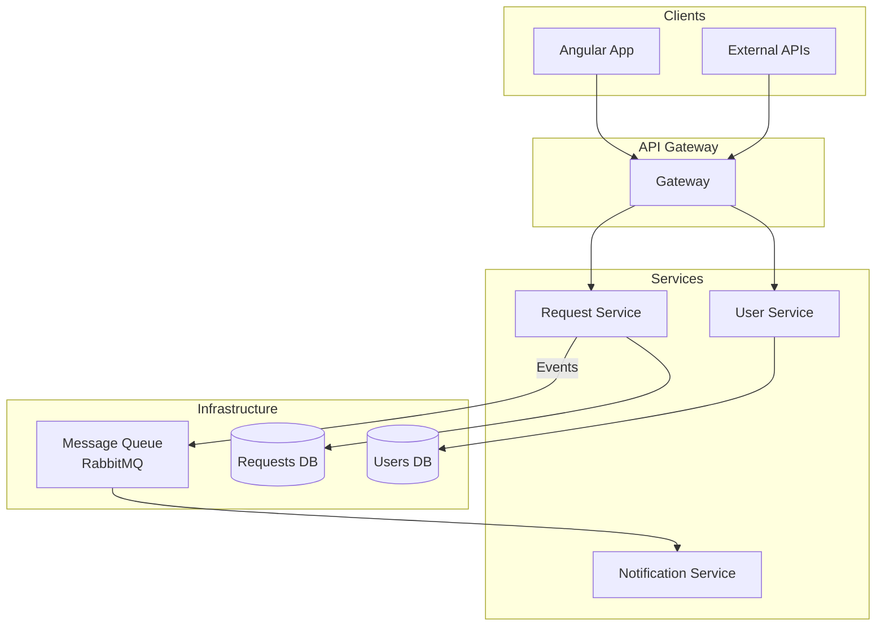
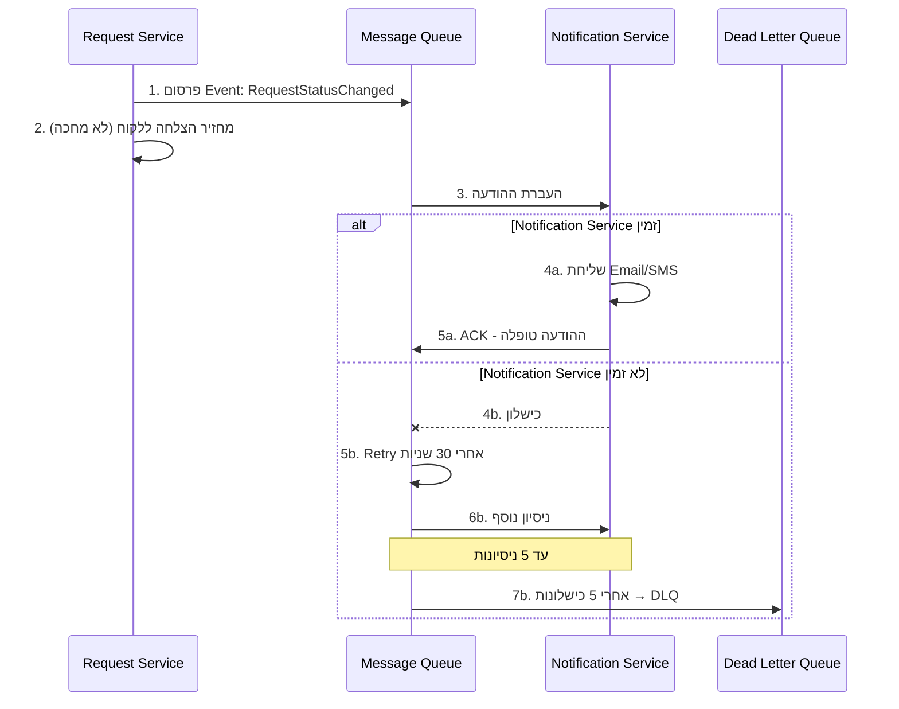

<div dir="rtl" align="right">

# מסמך ארכיטקטורה - מערכת ניהול בקשות

---

## חלק 1: מיגרציה ל-Microservices

### חלוקת שירותים מוצעת



### תיאור השירותים

| שירות | אחריות | Database |
|-------|--------|----------|
| **Request Service** | CRUD בקשות, חיפוש, סינון, מעקב סטטוס | Requests DB |
| **User Service** | אימות, הרשאות, ניהול משתמשים | Users DB |
| **Notification Service** | שליחת Email/SMS/Push | ללא (Stateless) |
| **API Gateway** | ניתוב, אימות, Rate Limiting | ללא |

### תועלות הארכיטקטורה

| תועלת | הסבר |
|-------|------|
| **סקלביליות עצמאית** | אפשר להגדיל רק את Request Service בעומס חיפושים, בלי לשכפל את כל המערכת |
| **פריסה עצמאית** | שינוי ב-Notification לא דורש Deploy של Request Service |
| **בידוד תקלות** | תקלה ב-Notification לא מפילה את יכולת החיפוש |
| **גמישות טכנולוגית** | Notification יכול להיות ב-Node.js אם מתאים יותר |
| **צוותים עצמאיים** | כל צוות אחראי על Service אחד |

---

## חלק 2: תקשורת אמינה - תרחיש Notification

### הבעיה

כאשר Request נוצר או משנה Status, צריך לשלוח Notification. אבל שירות ה-Notification עלול להיות לא זמין זמנית.

### הפתרון: תור הודעות עם Retry



### עקרונות המפתח

| עיקרון | מימוש | למה |
|--------|-------|-----|
| **אסינכרוניות** | Request Service מפרסם Event ולא מחכה לתשובה | הלקוח לא תקוע אם Notification איטי |
| **Transactional Outbox** | שינוי הסטטוס וה-Event נכתבים לטבלת Outbox באותה טרנזקציה. תהליך רקע מפרסם ל-RabbitMQ | פותר Dual-Write Problem - אם ה-DB התעדכן אבל הרשת נפלה, ה-Event לא יאבד |
| **Retry אוטומטי** | 5 ניסיונות עם Exponential Backoff | תקלות זמניות נפתרות לבד |
| **Dead Letter Queue** | הודעות שנכשלו נשמרות ב-DLQ | אף הודעה לא אובדת |
| **Idempotency** | כל הודעה עם ID ייחודי | אם נשלחה פעמיים, לא שולחים Email כפול |

### דוגמת Event

```json
{
  "eventId": "550e8400-e29b-41d4-a716-446655440000",
  "eventType": "RequestStatusChanged",
  "timestamp": "2024-01-15T10:30:00Z",
  "data": {
    "requestId": 123,
    "requestNumber": "REQ-001",
    "oldStatus": "New",
    "newStatus": "InProgress",
    "userId": 5
  }
}
```

### טיפול בכשלונות

```
ניסיון 1 → כישלון → המתנה 1 שנייה
ניסיון 2 → כישלון → המתנה 2 שניות
ניסיון 3 → כישלון → המתנה 4 שניות
ניסיון 4 → כישלון → המתנה 8 שניות
ניסיון 5 → כישלון → העברה ל-Dead Letter Queue
```

**מה קורה עם הודעות ב-DLQ:**
- התראה לצוות התפעול
- אפשרות לשליחה מחדש ידנית
- ניתוח לזיהוי בעיות חוזרות

---

## סיכום

| נושא | פתרון |
|------|-------|
| **חלוקה ל-Microservices** | 3 שירותים: Request, User, Notification |
| **תקשורת** | Message Queue (RabbitMQ) לתקשורת אסינכרונית |
| **עמידות** | Retry + Dead Letter Queue |
| **אמינות** | אף הודעה לא אובדת, גם אם Notification לא זמין |

</div>
